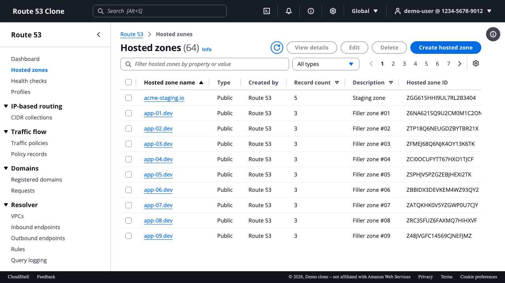
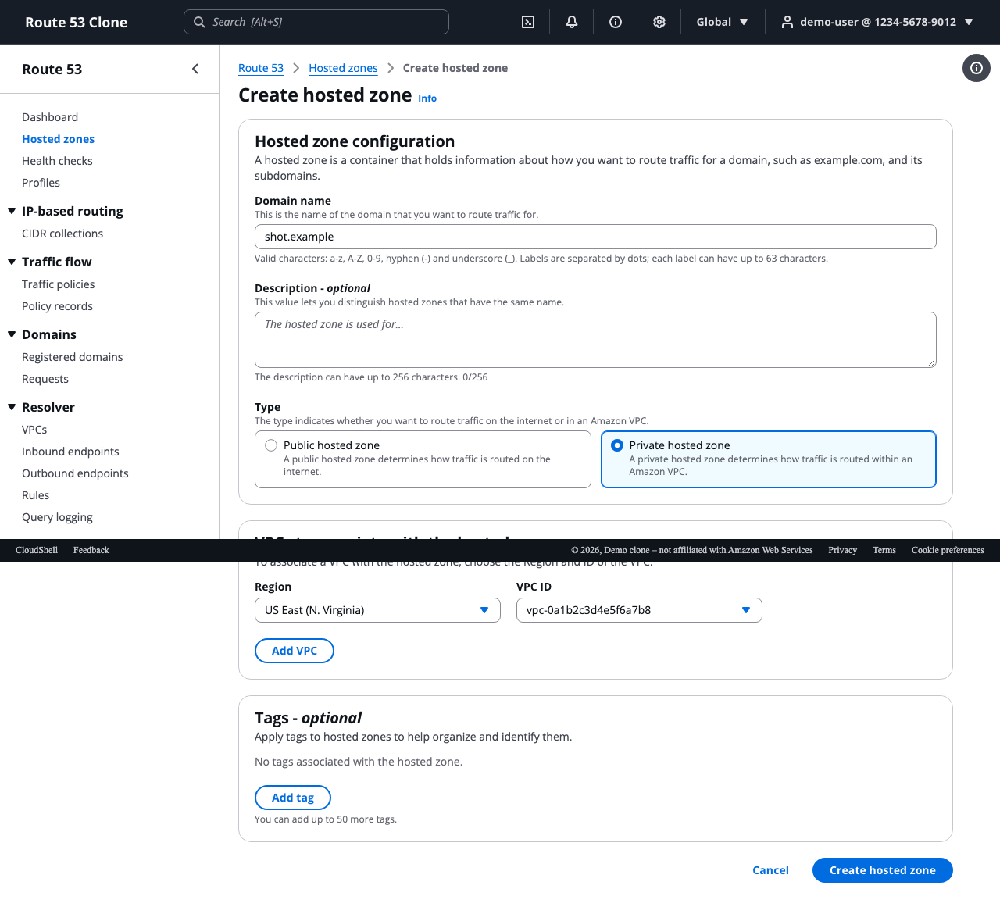
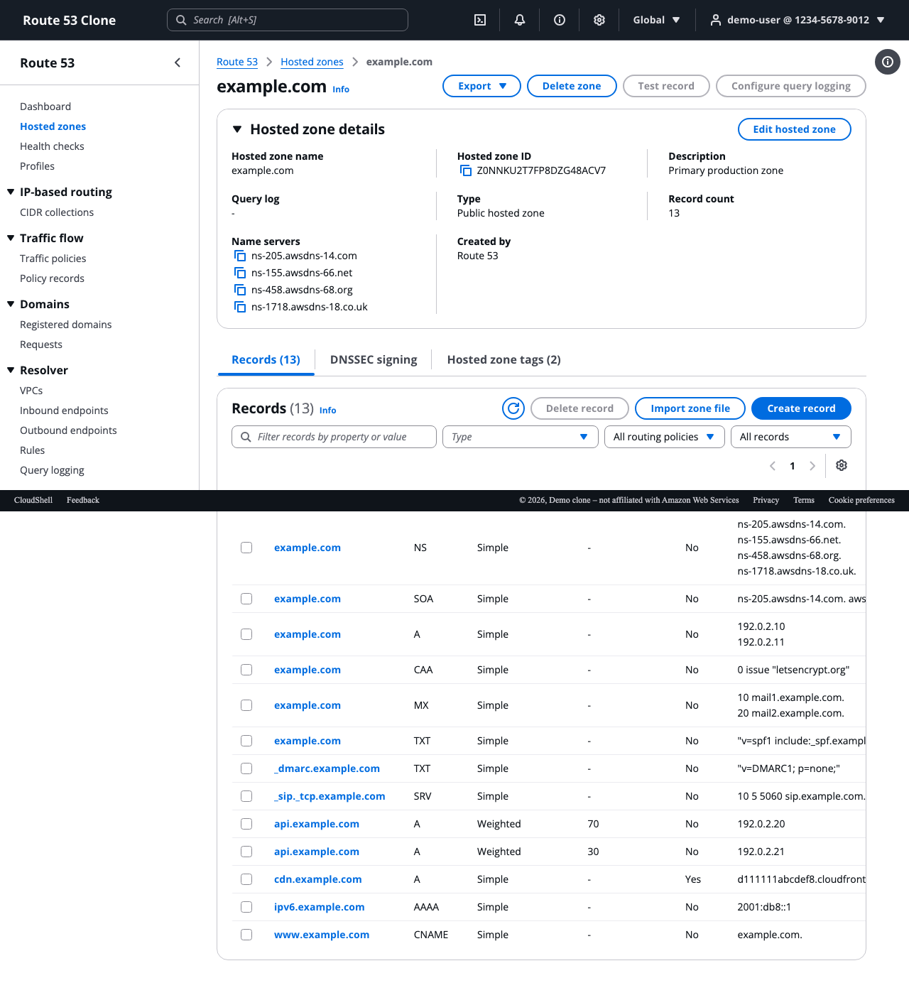
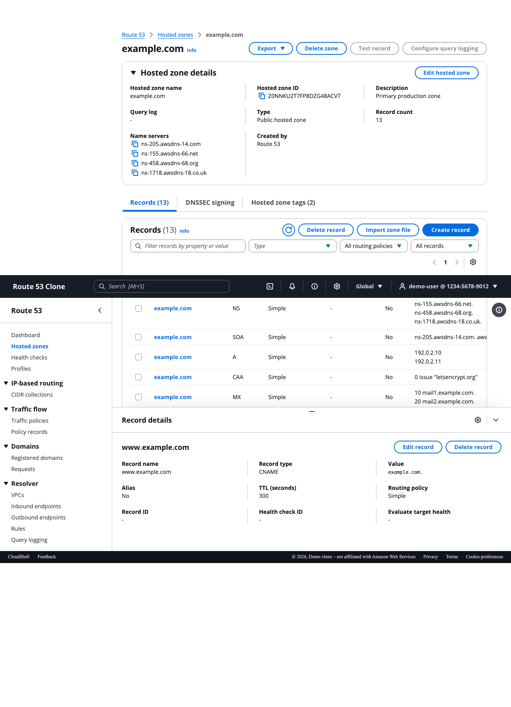
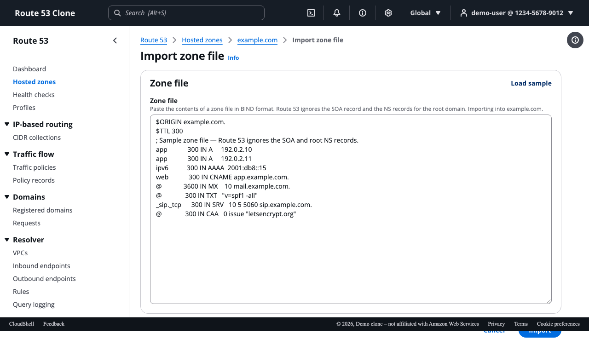
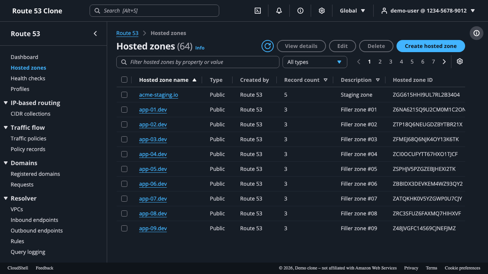
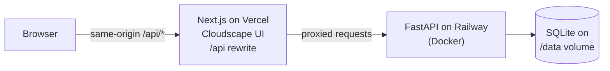
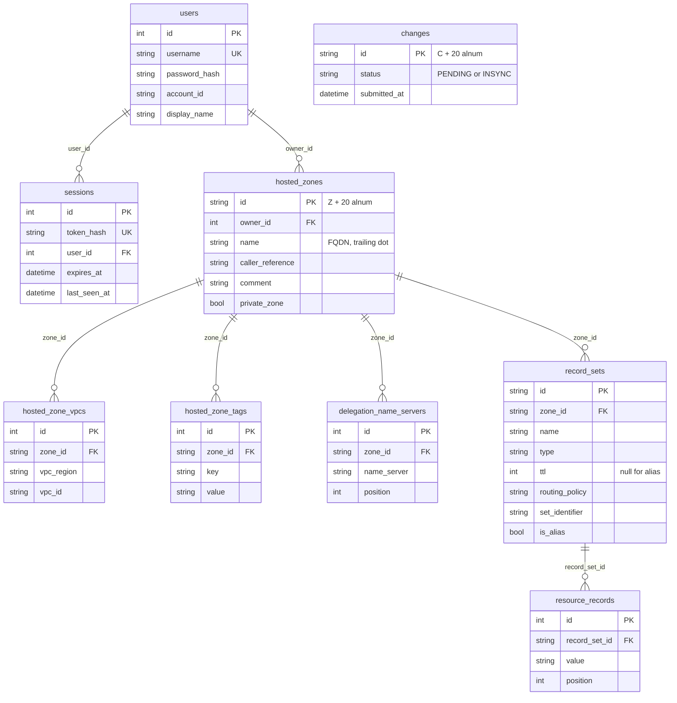

# Route 53 Console Clone

A functional clone of the AWS Route 53 console: hosted zone and DNS record management with
Route 53's exact look (Cloudscape Design System), wording, and behaviors — auto-created NS/SOA
records, protected records, CNAME constraints, change propagation status, BIND zone file
import/export, and more. Built as a take-home assignment with a FastAPI + SQLite backend and a
Next.js frontend.

Live demo: <https://scaler-omega.vercel.app> (backend health:
<https://scaler-bs7b.onrender.com/api/v1/health>)

Demo credentials: username `demo`, password `route53demo`.

> **First load**: the backend runs on a free tier and can take up to a minute to wake. The login
> page shows a "Connecting to server…" indicator until it responds.

> This is a demo project. It is **not affiliated with Amazon Web Services** and does not manage
> real DNS.

## Screenshots

| | |
|---|---|
|  |  |
|  |  |
|  |  |

## Features

Required scope:

- Cookie-session authentication (bcrypt, opaque tokens stored hashed, sliding expiry)
- Hosted zones: list (server-side search, type filter, sort, pagination, column preferences),
  create (public/private with VPC associations and tags), details, edit description, delete with
  type-to-confirm
- Records: list (search across names and values, type/routing/alias filters, sort, pagination),
  multi-record atomic create, edit, delete, multi-select batch delete, record details split panel
- All 10 record types (A, AAAA, CNAME, TXT, MX, NS, PTR, SRV, CAA, SOA) with per-type validation,
  7 routing policies, alias records
- Change tracking with PENDING → INSYNC status

Bonus:

- BIND zone file import (dnspython parser, atomic, skip reporting)
- Export as BIND zone file or AWS CLI-shaped JSON
- Dark mode + compact density (persisted, no flash of light theme)
- Keyboard shortcuts (`?` for the full list)
- Bulk operations: multi-select hosted zone delete with per-zone results

## Tech stack

- **Backend**: Python 3.12, FastAPI, SQLAlchemy 2.0 (typed `Mapped[]`), Pydantic v2, Alembic,
  SQLite, bcrypt, dnspython, pytest, ruff, uv
- **Frontend**: Next.js 16 (App Router), TypeScript strict, @cloudscape-design/components,
  TanStack React Query, react-hook-form + zod, Playwright

## Architecture



- **Why the rewrite**: the browser only ever calls `/api/*` on the Next.js origin;
  `next.config.ts` rewrites it server-side to `BACKEND_URL`. The `r53_session` cookie is
  therefore first-party (`SameSite=Lax` works, no third-party cookie issues, backend origin never
  exposed to the browser).
- **Backend layering**: routes (thin, HTTP concerns only) → services (all business rules:
  validation, Route 53 semantics, transactions) → SQLAlchemy models. No raw SQL in routes.
- **Frontend layering**: route files (thin server components exporting metadata) → client
  components (Cloudscape) → React Query hooks per resource (cache keys + invalidation) → one
  typed fetch client (error envelope parsing, 401 redirect).

## Database schema



Key constraints and indexes:

| Constraint / index | Why |
|---|---|
| Unique expression index on `(zone_id, name, type, COALESCE(set_identifier, ''))` | Enforces record-set identity at the database level even with NULL set identifiers (SQLite expression index); proven by a test that bypasses the service layer |
| **No** unique constraint on `hosted_zones.name` | Route 53 allows multiple hosted zones with the same name; the seed creates two `example.com` zones to prove it |
| `ON DELETE CASCADE` on every FK + `PRAGMA foreign_keys=ON` per connection | Zone deletion cascades vpcs/tags/delegation/records/values; SQLite needs the pragma for FK enforcement, set via an engine event listener |
| Unique `(zone_id, key)` on tags | Route 53 tag keys are unique per resource (max 50 enforced in the service) |
| Indexes on `(owner_id, name)`, `(zone_id, type)`, `(zone_id, name)` | List/search/sort access paths |
| `sessions.token_hash` unique | Only the SHA-256 hash of the opaque session token is stored |

## API overview

All endpoints are under `/api/v1` and require the session cookie, except `POST /auth/login` and
`GET /health`. Resources are scoped to the authenticated user; another user's zone returns 404,
never 403.

| Method | Path | Purpose |
|---|---|---|
| POST | `/auth/login` | Sign in, sets `r53_session` cookie |
| POST | `/auth/logout` | Delete the session, clear the cookie |
| GET | `/auth/me` | Current user |
| GET | `/hostedzones` | List zones (search/filter/sort/paginate) |
| POST | `/hostedzones` | Create zone (auto NS/SOA, VPCs, tags) |
| GET | `/hostedzones/{id}` | Zone details (name servers, vpcs, tags) |
| PATCH | `/hostedzones/{id}` | Edit the description (only mutable field) |
| DELETE | `/hostedzones/{id}` | Delete (fails with HostedZoneNotEmpty) |
| POST | `/hostedzones/batch-delete` | Bulk delete, per-zone results |
| GET | `/hostedzones/{id}/export?format=bind\|json` | Download the zone |
| GET | `/hostedzones/{id}/records` | List records (search/filter/sort/paginate) |
| POST | `/hostedzones/{id}/records` | Create one record or `{records:[...]}` atomically |
| POST | `/hostedzones/{id}/records/import` | Import a BIND zone file |
| POST | `/hostedzones/{id}/records/batch-delete` | Atomic batch delete |
| GET/PUT/DELETE | `/hostedzones/{id}/records/{recordId}` | Read / full update / delete |
| GET | `/changes/{id}` | Change status (INSYNC after ~3s) |
| GET | `/health` | Liveness |

**Error envelope** — every error returns:

```json
{"error": {"code": "InvalidChangeBatch", "message": "...", "details": [...]}}
```

Codes: `InvalidInput`, `InvalidChangeBatch`, `InvalidDomainName`, `InvalidZoneFile`,
`NoSuchHostedZone`, `NoSuchRecordSet`, `NoSuchChange`, `HostedZoneNotEmpty`, `TooManyTagKeys`,
`AccessDenied`, `NotAuthenticated`.

**List parameters**: `q` (substring search), `page`, `page_size`, `sort_by`, `sort_order`;
zones add `type=public|private`; records add `type` (CSV), `routing_policy`, `alias=true|false`.
Responses: `{items, total, page, page_size}` (records also return `total_unfiltered`).

**Example — create a hosted zone**:

```
POST /api/v1/hostedzones
{"name": "example.com", "comment": "prod", "private_zone": false, "tags": [{"key": "env", "value": "prod"}]}

201
{"hosted_zone": {"id": "Z1ABC...", "name": "example.com.", "record_count": 2, ...},
 "delegation_set": {"name_servers": ["ns-123.awsdns-01.com", ...]},
 "change": {"id": "C9XYZ...", "status": "PENDING", "submitted_at": "..."}}
```

**Example — create records (atomic batch)**:

```
POST /api/v1/hostedzones/{id}/records
{"records": [
  {"name": "www", "type": "A", "ttl": 300, "values": ["192.0.2.1", "192.0.2.2"]},
  {"name": "", "type": "MX", "values": ["10 mail.example.com."]}
]}

201
{"records": [{"id": "r...", "name": "www.example.com.", "type": "A", "protected": false, ...}, ...],
 "change": {"id": "C...", "status": "PENDING", ...}}
```

## Route 53 behaviors replicated

- Zone creation auto-inserts an apex NS record (TTL 172800) and SOA record (TTL 900) in the same
  transaction; public zones get a random four-TLD delegation set, private zones use the fixed
  placeholder set (`ns-0.awsdns-00.com` etc.) with a matching SOA mname.
- Protected records: the SOA can be edited but never deleted or created; the apex NS can't be
  deleted; a zone can only be deleted when nothing but apex NS + SOA remains.
- CNAME rules: single value, never at the zone apex, and cannot coexist with any other record
  type at the same name (enforced in both directions, including within a batch).
- Duplicate hosted zone names are allowed, exactly like Route 53.
- Every mutation returns a change (`C...` id) that flips PENDING → INSYNC about 3 seconds after
  submission, mimicking propagation.
- Alias records only for A/AAAA/CNAME (not at the apex for CNAME): `ttl` null, target DNS name +
  hosted zone id required, no resource records.
- TXT values are auto-wrapped in quotes with inner quotes escaped; each quoted string is limited
  to 255 characters.
- Zone file import skips the SOA and root NS records ("Route 53 ignores the SOA and root NS
  records") and reports every skipped record with a reason.

## Setup

Prerequisites: Python 3.12 with [uv](https://docs.astral.sh/uv/), Node 20+.

Backend (from `backend/`):

```bash
uv sync                        # create the venv and install dependencies
uv run alembic upgrade head    # create ./data/route53.db from the migration
uv run python -m scripts.seed  # idempotent demo data (demo user + 24 zones)
uv run uvicorn app.main:app --reload --port 8000
```

Frontend (from `frontend/`, backend running on :8000):

```bash
npm install
npm run dev                    # http://localhost:3000 — sign in with demo / route53demo
```

Environment variables are documented in `backend/.env.example` and `frontend/.env.example`;
the defaults work locally without any `.env` file.

Docker (backend):

```bash
cd backend
docker build -t r53-backend .
docker run -p 8000:8000 -e DATABASE_URL=sqlite:////data/route53.db -v r53-data:/data r53-backend
```

Tests:

```bash
cd backend && uv run pytest          # API + unit tests on a migrated temp DB
cd backend && uv run ruff check .

cd frontend && npm run lint && npm run build
# E2E needs the backend running first (see backend commands above), then:
cd frontend && npm run test:e2e      # Playwright starts the frontend itself
```

## Testing

- **Backend: 46 pytest tests** — DNS validation per record type, auth flow, zone CRUD invariants
  (auto NS/SOA, duplicate names, private VPC rules, delete guard), record CRUD (CNAME conflicts,
  duplicates, protected records, atomic batch rollback), DB-level uniqueness (IntegrityError via
  direct inserts), zone file import/export incl. a bind round-trip, cross-user 404 isolation.
- **Frontend: 26 Playwright tests** in a real Chromium — auth flow, zones (filters, preference
  persistence, create public/private, edit, delete guards, bulk delete with mixed results),
  records (atomic multi-create, server error mapped to the right form block, split panel, edit +
  change status, SOA protection, batch delete, zone file import, export download), dark mode
  persistence, keyboard shortcuts, plus a screenshot capture run.

## Deployment

- **Backend — Render (live host, free tier)**: Docker service with root directory `backend/`
  (build filter `backend/**`), health check path `/api/v1/health`. Set
  `CORS_ORIGINS=<frontend origin>` and `COOKIE_SECURE=true`. `start.sh` migrates, starts the
  seed in the background and binds the port within seconds. Run a **single instance** — SQLite
  does not support horizontal scaling.
- **Frontend — Vercel**: set the project root directory to `frontend/` and
  `BACKEND_URL=<render url>`. The `/api/*` rewrite keeps the session cookie first-party, so no
  extra cookie or CORS configuration is needed on the Vercel side.
- **Alternative with persistence — Railway**: same Dockerfile; attach a volume mounted at
  `/data` and set `DATABASE_URL=sqlite:////data/route53.db`.

> **Hosted demo persistence**: the free host has no persistent disk, so the hosted SQLite file
> resets on redeploy/restart and is re-seeded automatically. Locally, and on any host with a
> mounted volume (e.g. Railway with `DATABASE_URL=sqlite:////data/route53.db`), data persists
> across restarts.

## Mocked / out of scope

- IAM, organizations, billing — the account menu entries are inert; auth is a single demo user.
- Real DNS resolution or registrar integration; name servers are generated strings.
- Health checks, traffic policies, CIDR collections, Resolver, DNS Firewall, domain registration —
  "coming soon" pages only.
- Deep validation of routing policies beyond SIMPLE/WEIGHTED (latency/failover/geo fields are
  stored and surfaced, but only shallowly validated).
- VPC pickers use a mocked region/VPC catalog; health check IDs are free text.

## Project structure

```
.
├── backend/
│   ├── alembic/           # migrations (tests run against these, not create_all)
│   ├── app/
│   │   ├── api/           # deps + v1 routes (thin)
│   │   ├── core/          # config, errors, security
│   │   ├── db/            # engine/session, Base, FK pragma
│   │   ├── models/        # SQLAlchemy typed models
│   │   ├── schemas/       # Pydantic request/response models
│   │   └── services/      # business rules: zones, records, dns_validation, zone files
│   ├── scripts/           # idempotent seed
│   ├── tests/             # pytest (46)
│   ├── Dockerfile · start.sh · .env.example
├── frontend/
│   ├── src/
│   │   ├── app/           # App Router routes (thin, metadata only)
│   │   ├── components/    # shell/, hosted-zones/, records/, common/ (Cloudscape)
│   │   ├── lib/           # api client+hooks+types, validation, format, shortcuts
│   │   └── providers/     # query, notifications, settings, auth guard
│   ├── tests/e2e/         # Playwright (26)
│   └── .env.example
└── docs/screenshots/
```
